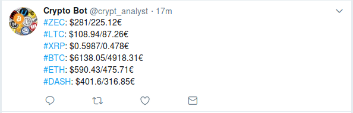

# twitter-bot-rs
A Twitter bot written in Rust that scans crypto-currency values and
post periodically a message on Twitter with the value of currencies.




## How to run it
1. Edit ```$HOME/.crypto-bot.conf``` and put values your want in your config file
2. Issue ```cargo run```

## Config File
```
{
  "consumer_key": "<consumer-key>",
  "consumer_secret": "<consumer-secret>",
  "access_key": "<access-key>",
  "access_secret": "<access-secret>",
  "currencies_to_follow" : ["BTC","LTC","ETH", "DASH", "ZEC", "XRP"],
  "interval_sec" : 5
}
```
